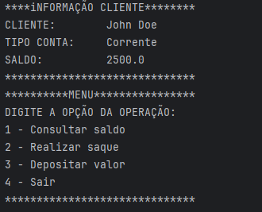

# Sistema bancário
Aplicação construída com Java para treinar e fixar alguns conceitos de programação.

Essa aplicação simula situações de um usuário interagindo com um sistema de conta bancária.

### Conceitos utilizados nesse projeto:

- Variáveis primitivas;
- Classe String;
- Condicionais: if-else | switch;
- laços de repetição: While;

SDK utilizada nesse projeto: JDK LTS 17.0.15.

